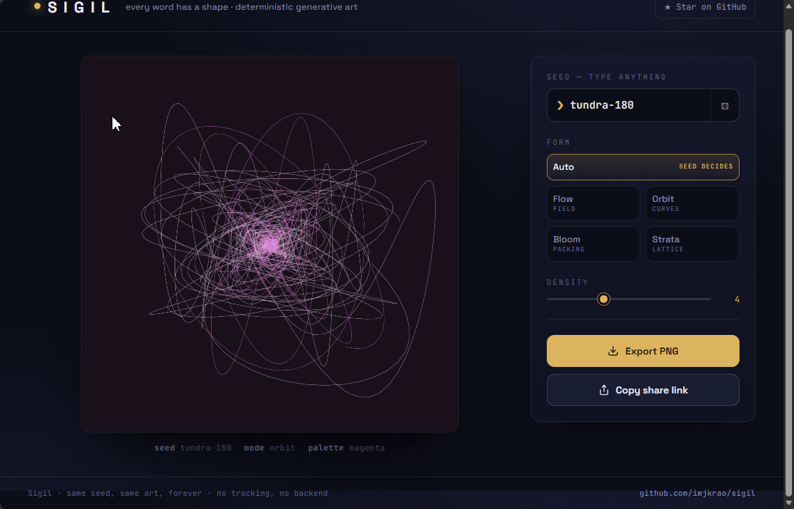

<div align="center">

# ✦ Sigil

### Every word has a shape.

Type anything — your name, a mood, a password you'll never use — and Sigil turns it into a one-of-a-kind piece of generative art. The same word **always** produces the same artwork, so you can share a piece just by sharing the word.

**[▶ Live demo](https://imjkrao.github.io/sigil)** · No install · No backend · No tracking · One HTML file

<!-- Replace with a real GIF/screenshot of your art. This is the single most important thing for stars. -->
<!--  -->

</div>

---

## Why it's fun

- **Deterministic.** `aurora` looks like `aurora` on every device, forever. Art you can reproduce from a single string.
- **Shareable by link.** Every piece has a URL like `?s=aurora&m=flow`. Send it; the recipient sees the exact same art.
- **Four forms.** Flow fields, harmonograph curves, circle packing, and recursive lattices — or let the seed pick.
- **Export at 2160×2160.** Crisp PNGs for wallpapers, profile art, prints, stickers.
- **Zero dependencies.** One `index.html`. No build step, no npm, no framework. Reads in one sitting.

## Try these seeds

`aurora` · `midnight-oil` · `koi` · `your-name-here` · `404` · `saudade`

Nudge the **Density** slider and switch **Form** to see how far one word can stretch.

## How it works

A text seed is hashed (`xmur3`) into a 32-bit number that seeds a fast PRNG (`mulberry32`). Every visual decision — palette, form, particle count, curve frequencies — is drawn from that single deterministic stream. Same seed in, same numbers out, same art out. All geometry is computed in normalized `[0,1]` space and scaled at draw time, so a thumbnail and a 2160px export are pixel-composition identical.

No canvas library, no randomness that isn't seeded, nothing phones home.

## Run it

It's one file. Any of these work:

```bash
# just open it
open index.html

# or serve it
python3 -m http.server
```

## Deploy in 30 seconds

1. Fork this repo (or push it as your own).
2. **Settings → Pages → Source: `main` / root.**
3. Open `https://<you>.github.io/sigil` — done.

Then edit the `REPO` constant near the bottom of `index.html` so the ★ button points at your repo.

## Make it yours

Each form lives in its own small function (`makeFlow`, `makeOrbit`, `makeBloom`, `makeStrata`) with a single `step()` method that draws one animation frame. Add a new form by writing one function and adding it to `BUILDERS`. Palettes are generated in `buildPalette()` — swap the color schemes there to change the whole mood.

## Contributing

New forms, new palettes, better exports — PRs welcome. Keep it dependency-free and single-file; that constraint is the point.

## License

MIT — do anything, just keep the notice. See [LICENSE](LICENSE).
